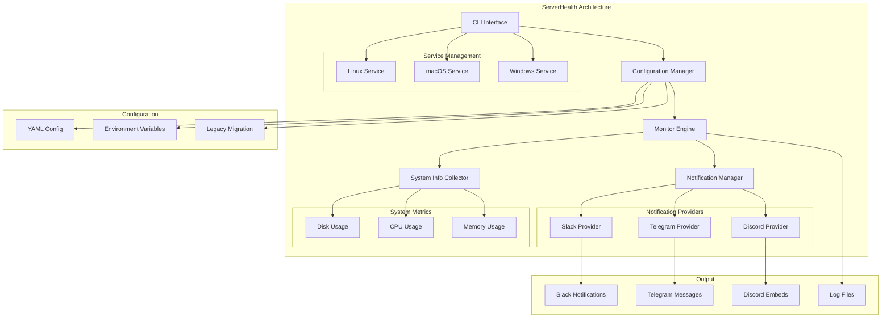

# 🏥 ServerHealth

A beautiful, cross-platform CLI tool for monitoring server health with modular notification support (Slack, Telegram, Discord).

[](https://golang.org)
[](LICENSE)
[](https://github.com/kailashvele/serverhealth/releases)

## 🏗️ Architecture



## ✨ Features

- 🎨 **Interactive CLI** - Beautiful configuration wizard with arrow key navigation
- 📊 **Multi-Metric Monitoring** - Disk, CPU, and memory usage tracking
- 🔔 **Modular Notifications** - Support for Slack, Telegram, and Discord
- 🚀 **Background Service** - Runs continuously as system service or daemon
- 🔧 **Cross-Platform** - Works on Linux, macOS, and Windows
- ⚙️ **Enhanced YAML Configuration** - Structured configuration with validation
- 📝 **Multiple Run Modes** - Foreground, background, or system service
- 🛡️ **Rate Limiting** - Per-metric daily alert limits
- 📋 **Easy Log Viewing** - Built-in log management and viewing
- 🔄 **Legacy Migration** - Automatic migration from old configuration format

## 🚀 Quick Start

### Installation

**Option 1: One-line installer (Linux/macOS)**

```bash
curl -sSL https://raw.githubusercontent.com/kailashvele/serverhealth/main/install.sh | bash
```

**Option 2: Download from releases**

```bash
# Download the latest release for your platform
wget https://github.com/kailashvele/serverhealth/releases/latest/download/serverhealth-1.0.4-linux-amd64.tar.gz
tar -xzf serverhealth-1.0.4-linux-amd64.tar.gz
sudo mv serverhealth /usr/local/bin/
```

**Option 3: Package managers**

```bash
# Ubuntu/Debian (coming soon)
sudo apt install serverhealth

# CentOS/RHEL/Fedora (coming soon)
sudo yum install serverhealth

# macOS (coming soon)
brew install serverhealth
```

### Basic Usage

```bash
# 1. Configure monitoring settings
serverhealth configure

# 2. Start monitoring (foreground)
serverhealth start

# 3. Start in background
serverhealth start --background

# 4. Install as system service
sudo serverhealth install
sudo systemctl start serverhealth  # Linux
# or
launchctl start serverhealth       # macOS

# 5. Check status
serverhealth status

# 6. View logs
serverhealth logs

# 7. Stop monitoring
serverhealth stop
```

## 📖 Documentation

### Configuration

ServerHealth uses an interactive configuration wizard that guides you through:

1. **Monitoring Options** - Choose which metrics to monitor
2. **Notification Providers** - Configure Slack, Telegram, and Discord
3. **Alert Thresholds** - Configure when to receive alerts
4. **Check Intervals** - Set how often to check each metric

### Enhanced YAML Configuration

The new configuration structure supports multiple notification providers and enhanced monitoring settings:

```yaml
# Monitoring Configuration
disk:
  enabled: true
  threshold: 80
  check_interval: 12 # hours
  max_daily_alerts: 5

cpu:
  enabled: true
  threshold: 85
  check_interval: 60 # minutes
  max_daily_alerts: 5

memory:
  enabled: true
  threshold: 85
  check_interval: 60 # minutes
  max_daily_alerts: 5

# Notification Providers
notifications:
  - type: slack
    enabled: true
    webhook_url: "https://hooks.slack.com/services/YOUR/WEBHOOK"

  - type: telegram
    enabled: true
    bot_token: "YOUR_BOT_TOKEN"
    chat_id: "YOUR_CHAT_ID"

  - type: discord
    enabled: true
    webhook_url: "https://discord.com/api/webhooks/YOUR/WEBHOOK"

# General Settings
log_level: info
service_name: serverhealth
```

### Run Modes

| Mode               | Command                           | Description                         |
| ------------------ | --------------------------------- | ----------------------------------- |
| **Foreground**     | `serverhealth start`              | Runs in terminal, shows live output |
| **Background**     | `serverhealth start --background` | Runs as background process          |
| **System Service** | `serverhealth install`            | Installs as system service          |

### Commands

| Command                           | Description                           |
| --------------------------------- | ------------------------------------- |
| `serverhealth configure`          | Interactive configuration wizard      |
| `serverhealth start`              | Start monitoring (foreground)         |
| `serverhealth start --background` | Start as background daemon            |
| `serverhealth status`             | Show current status and configuration |
| `serverhealth stop`               | Stop all running instances            |
| `serverhealth install`            | Install as system service             |
| `serverhealth uninstall`          | Remove system service                 |
| `serverhealth logs`               | View logs (live tail)                 |
| `serverhealth --help`             | Show help information                 |

### Configuration File

Configuration is stored in:

- **Linux**: `~/.config/serverhealth/config.yaml`
- **macOS**: `~/Library/Application Support/serverhealth/config.yaml`
- **Windows**: `%APPDATA%\serverhealth\config.yaml`

## 🔔 Notification Providers

### Slack Notifications

**Setup:**

1. Go to your Slack workspace
2. Create a new app or use an existing one
3. Enable "Incoming Webhooks"
4. Create a webhook URL
5. Copy the webhook URL

**Configuration:**

```yaml
notifications:
  - type: slack
    enabled: true
    webhook_url: "https://hooks.slack.com/services/YOUR/SLACK/WEBHOOK"
```

### Telegram Notifications

**Setup:**

1. Create a bot with [@BotFather](https://t.me/botfather)
2. Get your bot token
3. Get your chat ID by sending a message to your bot and checking [@userinfobot](https://t.me/userinfobot)

**Configuration:**

```yaml
notifications:
  - type: telegram
    enabled: true
    bot_token: "YOUR_BOT_TOKEN_HERE"
    chat_id: "YOUR_CHAT_ID_HERE"
```

### Discord Notifications

**Setup:**

1. Go to your Discord server
2. Edit a channel
3. Go to Integrations > Webhooks
4. Create a new webhook
5. Copy the webhook URL

**Configuration:**

```yaml
notifications:
  - type: discord
    enabled: true
    webhook_url: "https://discord.com/api/webhooks/YOUR/DISCORD/WEBHOOK"
```

## 🛠️ Development

### Prerequisites

- Go 1.21 or higher
- Make (optional, for using Makefile)

### Build from Source

```bash
# Clone the repository
git clone https://github.com/kailashvele/serverhealth.git
cd serverhealth

# Install dependencies
go mod download

# Build for current platform
go build -o serverhealth .

# Or use the build script for all platforms
./build_release.sh 1.0.4
```

### Development Setup

```bash
# Install development dependencies
go mod download

# Run linting
make lint

# Run tests
make test

# Format code
make fmt

# Build for development
make build

# Run locally
./serverhealth configure
./serverhealth start
```

### Project Structure

```
serverhealth/
├── main.go                 # Application entry point
├── commands.go             # CLI commands implementation
├── config.go               # Configuration management
├── configuration_wizard.go # Interactive setup wizard
├── monitor.go              # Core monitoring logic
├── notifications.go        # Modular notification system
├── system_info.go          # System metrics collection
├── service_linux.go        # Linux service management
├── service_darwin.go       # macOS service management
├── service_windows.go      # Windows service management
├── service_fallback.go     # Fallback for unsupported platforms
├── syscall_unix.go         # Unix process management
├── syscall_windows.go      # Windows process management
├── build_release.sh        # Cross-platform build script
├── install.sh              # Installation script
├── Makefile               # Development commands
├── config.yaml.example    # Example configuration
├── test-config.yaml       # Test configuration
├── test-config-minimal.yaml # Minimal test configuration
├── test-config-env.yaml   # Environment variable example
├── MODULAR_NOTIFICATIONS.md # Notification system documentation
├── TEST_CONFIGURATIONS.md  # Test configuration documentation
└── LINUX_OPTIMIZATIONS.md # Linux-specific optimizations
```

### Cross-Platform Build

The project supports building for multiple platforms:

```bash
# Build for all platforms
./build_release.sh 1.0.4

# Manual cross-compilation
GOOS=linux GOARCH=amd64 go build -o serverhealth-linux-amd64
GOOS=windows GOARCH=amd64 go build -o serverhealth-windows-amd64.exe
GOOS=darwin GOARCH=amd64 go build -o serverhealth-darwin-amd64
GOOS=darwin GOARCH=arm64 go build -o serverhealth-darwin-arm64
```

### Contributing

1. Fork the repository
2. Create your feature branch (`git checkout -b feature/amazing-feature`)
3. Commit your changes (`git commit -m 'Add some amazing feature'`)
4. Push to the branch (`git push origin feature/amazing-feature`)
5. Open a Pull Request

### Development Commands

```bash
# Run all checks
make dev

# Individual commands
make lint          # Run linter
make test          # Run tests
make build         # Build for current platform
make clean         # Clean build artifacts
make fmt           # Format code
```

## 🔧 Platform-Specific Notes

### Linux

- Uses `systemd` for service management
- Requires `systemctl` for service operations
- Creates system user `serverhealth` for service mode
- Optimized with native Go system calls for `/proc` filesystem

### macOS

- Uses `launchd` for service management
- Supports both user and system services
- Service files stored in `~/Library/LaunchAgents/` or `/Library/LaunchDaemons/`

### Windows

- Uses Windows Service Control Manager
- Requires administrator privileges for service installation
- Uses `sc` command for service management
- PowerShell-based system metrics collection

## 📊 Monitoring Details

### Disk Usage

- Monitors root filesystem (`/`) on Unix systems
- Configurable threshold (default: 80%)
- Check interval in hours (default: 12 hours)
- Maximum daily alerts configurable per metric

### CPU Usage

- Monitors overall CPU utilization
- Configurable threshold (default: 85%)
- Check interval in minutes (default: 60 minutes)
- Maximum daily alerts configurable per metric

### Memory Usage

- Monitors RAM utilization
- Configurable threshold (default: 85%)
- Check interval in minutes (default: 60 minutes)
- Maximum daily alerts configurable per metric

### Notification System

- **Multiple Providers**: Slack, Telegram, Discord simultaneously
- **Concurrent Processing**: All providers send notifications concurrently
- **Retry Logic**: 3 attempts with 5-second delays
- **Rate Limiting**: Per-metric daily alert limits
- **Rich Notifications**: Structured messages with metadata
- **Notification Levels**: Info (ℹ️), Warning (⚠️), Error (❌)

## 🔒 Security

- Configuration files are created with restricted permissions
- Service runs with dedicated system user (Linux)
- No sensitive data stored in logs
- Webhook URLs and bot tokens are stored securely
- Input validation for all configuration values
- Environment variable sanitization

## 🐛 Troubleshooting

### Common Issues

**Service won't start**

```bash
# Check service status
systemctl status serverhealth

# View logs
serverhealth logs

# Check configuration
serverhealth status
```

**Permission denied**

```bash
# Ensure proper permissions
sudo chown -R serverhealth:serverhealth /etc/serverhealth
sudo chmod 755 /usr/local/bin/serverhealth
```

**Configuration not found**

```bash
# Reconfigure
serverhealth configure

# Check config file location
ls -la ~/.config/serverhealth/
```

**Notification not working**

```bash
# Check notification configuration
serverhealth status

# Verify webhook URLs and credentials
# Test with debug logging
./serverhealth start
```

### Debug Mode

Enable debug logging to see detailed information:

```bash
# Edit config.yaml to enable debug logging
log_level: debug

# Or run with debug output
./serverhealth start --debug
```

## 📝 License

This project is licensed under the MIT License - see the [LICENSE](LICENSE) file for details.

## 🤝 Support

- 📧 **Email**: [kailashvele@gmail.com](mailto:kailashvele@gmail.com)
- 🐛 **Issues**: [GitHub Issues](https://github.com/kailashvele/serverhealth/issues)
- 💬 **Discussions**: [GitHub Discussions](https://github.com/kailashvele/serverhealth/discussions)

## 🎯 Roadmap

- [x] Modular notification system (Slack, Telegram, Discord)
- [x] Enhanced YAML configuration
- [x] Linux optimizations with native system calls
- [ ] More notification channels (Email, PagerDuty, OpsGenie)
- [ ] Network monitoring
- [ ] Process monitoring
- [ ] Database health checks
- [ ] Docker container monitoring
- [ ] Web dashboard
- [ ] Metric history and trends
- [ ] Custom metric plugins
- [ ] Notification templates
- [ ] Advanced filtering

---

Made with ❤️ by [Kailash Vele](https://github.com/kailashvele)
